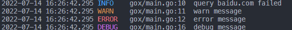

## 终端

```go
package main

import "github.com/yahuian/gox/logx"

func main() {
	logx.Init(nil)
	defer logx.Sync()

	logx.Debug("debug message")
	logx.Infof("query %s failed", "baidu.com")
	logx.Warn("warn message")
	logx.Error("error message")

	logx.SetLevel(logx.DebugLevel) // 调整日志级别

	logx.Debug("debug message")
}
```



## 终端和文件

```go
	// 增加文件相关配置
	file := &logx.FileOption{
		Filename: "/var/log/app.log",
		MaxSize:  100,            // MB
		MaxAge:   30,             // days
		Compress: true,           // .gz
		Duration: time.Hour * 24, // 每24h切割一次
	}

	logx.Init(file)
```

```log
{"level":"info","time":"2022-07-14 16:32:56.788","caller":"gox/main.go:22","msg":"query baidu.com failed"}
{"level":"warn","time":"2022-07-14 16:32:56.788","caller":"gox/main.go:23","msg":"warn message"}
{"level":"error","time":"2022-07-14 16:32:56.788","caller":"gox/main.go:24","msg":"error message"}
{"level":"debug","time":"2022-07-14 16:32:56.788","caller":"gox/main.go:28","msg":"debug message"}
```